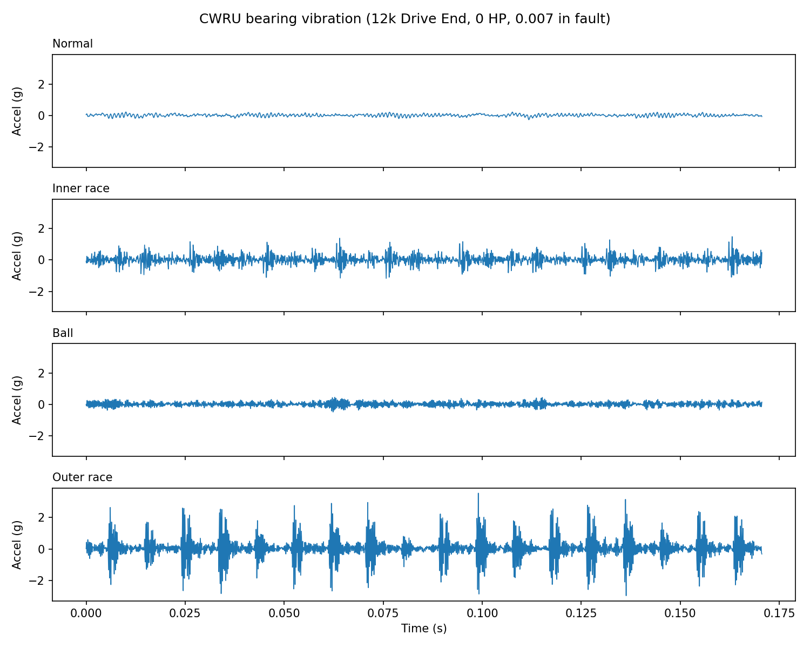
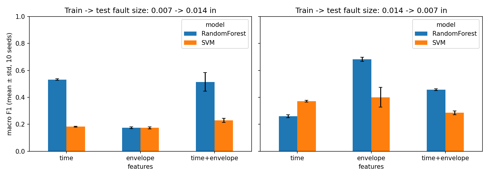
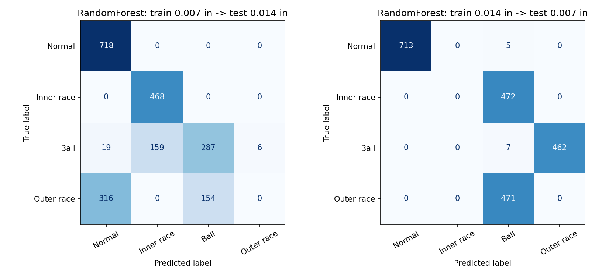

# Bearing Fault Diagnosis: Cross-Fault-Size Generalization (CWRU)
**Live demo:** [Bearing Fault Monitor](https://bearing-predictive-maintenance-dxcmyvq5bs7pwqzzerkyex.streamlit.app)

Machine learning pipeline for bearing fault diagnosis on the CWRU bearing dataset, built from a mechanical engineering perspective. The project asks a simple question: **do models that look accurate on CWRU still work when the fault size changes?**

## Key findings

1. **Cross-load evaluation is too easy.** Leave-one-load-out on a single fault size gives 100% accuracy with simple time-domain features, so it says little about real generalization.
2. **Changing fault size breaks time-domain models.** Training on 0.007 in faults and testing on 0.014 in (and the reverse) drops accuracy to roughly 30-70%.
3. **Envelope-spectrum features help in one direction only.** Features based on bearing fault frequencies (BPFO, BPFI, BSF) are amplitude-independent. Training on 0.014 in and testing on 0.007 in, they raise RandomForest macro F1 from about 0.26 to about 0.68. Training on 0.007 in and testing on 0.014 in, they did not help.

## Data

[CWRU Bearing Data Center](https://engineering.case.edu/bearingdatacenter): 12 kHz drive-end accelerometer, loads 0-3 HP, Normal / Inner race / Ball / Outer race (@6:00), fault sizes 0.007 in and 0.014 in. Raw `.mat` files are not included in this repo; download them from the link above into `data/raw/`.

## Method

1. Cut signals into overlapping windows (2048 or 4096 samples).
2. **Time-domain features:** RMS, peak, peak-to-peak, kurtosis, skewness, crest factor.
3. **Envelope-spectrum features:** band-pass 2-5.5 kHz, Hilbert envelope, relative energy at BPFO / BPFI / BSF (1x and 2x), using the shaft speed of each load (SKF 6205-2RS fault orders).
4. Classifiers: Random Forest and RBF SVM.
5. Evaluation: leave-one-load-out, then cross-fault-size (train on one size, test on the other), repeated over 10 seeds.

Normal recordings are shared between fault sizes, so the first half of each Normal file is used for training and the second half for testing to avoid leakage.

## Results



Cross-fault-size macro F1 (mean ± std over 10 seeds):

| Direction (train -> test, in) | Features | Model | Macro F1 |
|---|---|---|---|
| 0.007 -> 0.014 | envelope | RandomForest | 0.174 ± 0.007 |
| 0.007 -> 0.014 | envelope | SVM | 0.173 ± 0.008 |
| 0.007 -> 0.014 | time | RandomForest | 0.532 ± 0.005 |
| 0.007 -> 0.014 | time | SVM | 0.182 ± 0.004 |
| 0.007 -> 0.014 | time+envelope | RandomForest | 0.514 ± 0.069 |
| 0.007 -> 0.014 | time+envelope | SVM | 0.229 ± 0.016 |
| 0.014 -> 0.007 | envelope | RandomForest | 0.682 ± 0.014 |
| 0.014 -> 0.007 | envelope | SVM | 0.401 ± 0.073 |
| 0.014 -> 0.007 | time | RandomForest | 0.260 ± 0.011 |
| 0.014 -> 0.007 | time | SVM | 0.371 ± 0.006 |
| 0.014 -> 0.007 | time+envelope | RandomForest | 0.457 ± 0.006 |
| 0.014 -> 0.007 | time+envelope | SVM | 0.285 ± 0.014 |





## Limitations

- Each (fault size, load, class) combination is a **single recording**. The standard deviations only reflect window sampling and model randomness, not recording-to-recording variation.
- Only two fault sizes and one fault position (outer race @6:00) were used.
- The SVM was not tuned, so SVM results should not be used to compare feature sets.
- The envelope band (2-5.5 kHz) and frequency tolerance were fixed by hand, not optimized.
- The asymmetry between the two directions is not yet explained. A possible reason is that the weaker 0.007 in impacts leave less distinct envelope peaks, but this is a hypothesis, not a tested result.
- The dashboard is a workflow demo. Its model is trained on all fault sizes and loads, and the sample signals come from that same data, so its diagnoses are not a valid test. Performance claims come only from the cross-fault-size experiments (06). On the Normal sample it still flags about 25% of windows as faulty.

## Run it

```
git clone https://github.com/easirht/bearing-predictive-maintenance.git
cd bearing-predictive-maintenance
python -m venv venv
venv\Scripts\activate
pip install -r requirements.txt
python notebooks/06_multi_seed.py
```

## Structure

```
src/data_loader.py   file mapping and .mat loading
src/features.py      time-domain and envelope features
notebooks/           numbered experiment scripts (01-06)
results/             figures and CSV results
```

## Next steps

- Tune the envelope band and the SVM
- 1D-CNN on raw signals
- Remaining useful life prediction on the NASA IMS dataset
- Streamlit dashboard with automatic fault alerts

## License

MIT